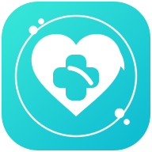
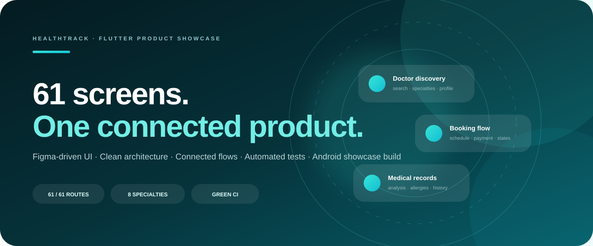
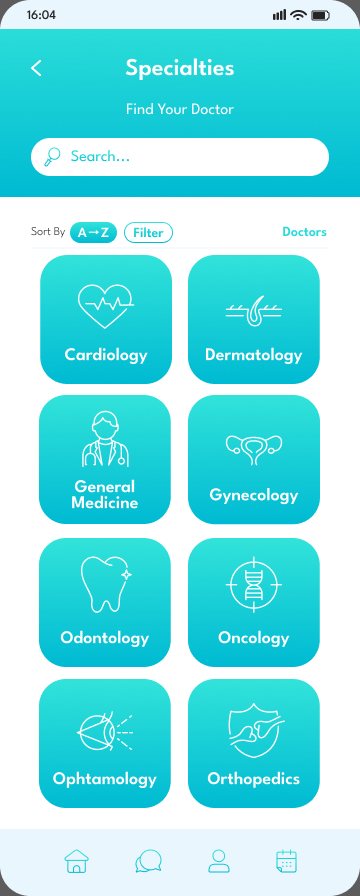
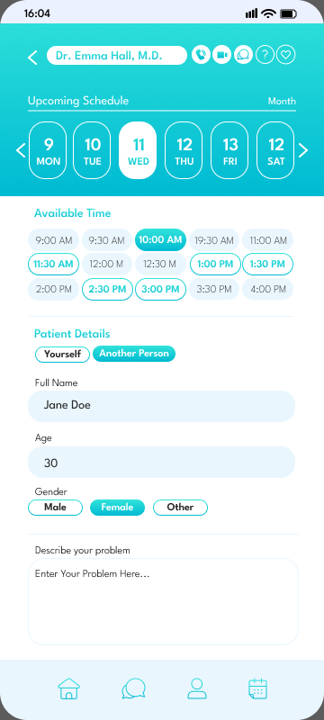
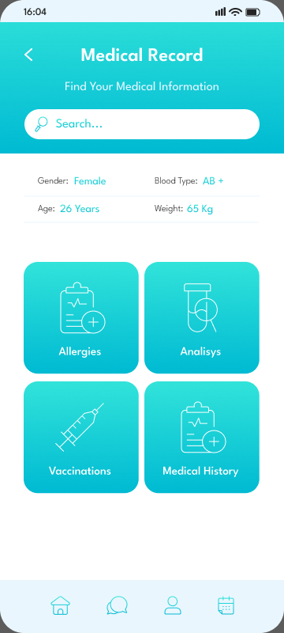
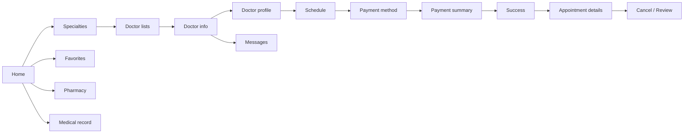
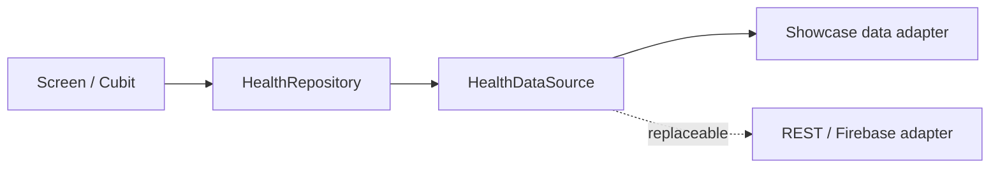

<div align="center">





# HealthTrack

### 61-screen Flutter product implementation from a Figma Community healthcare UI system

[](https://github.com/Husseinabozina/medical_app/actions/workflows/flutter_ci.yml)
[](https://github.com/Husseinabozina/medical_app/actions/workflows/publish_showcase_apk.yml)


**[Open the live portfolio](https://husseinabozina.github.io/medical_app/)** ·
**[Download Android APK](https://github.com/Husseinabozina/medical_app/releases/download/showcase-latest/healthtrack-demo.apk)** ·
**[Open the Figma source](https://www.figma.com/design/jrf18b58l0rdFM4uTN5DEg/Medical-App-UI-Kit-Health-Mobile-App-Tracker-Appointment-Mobile-App--Community-?node-id=2279-1229&m=dev)**

</div>

---

## Product at a glance

<table>
<tr>
<td width="25%" align="center"><h2>61 / 61</h2><sub>top-level Figma frames mapped to Flutter routes</sub></td>
<td width="25%" align="center"><h2>8</h2><sub>medical specialty doctor flows</sub></td>
<td width="25%" align="center"><h2>1</h2><sub>replaceable repository/data-source boundary</sub></td>
<td width="25%" align="center"><h2>CI ✓</h2><sub>Flutter analyze + automated tests</sub></td>
</tr>
</table>

HealthTrack is a **complete Flutter implementation** of a public Figma Community medical UI kit. The project focuses on translating the visual system into reusable Flutter code, connecting the source frames into coherent product journeys, and keeping the presentation layer independent from the concrete data source.

The original Figma Community file is the **design reference**. This repository represents my Flutter implementation and engineering work; it does not claim authorship of the source UI kit.

## Selected interface previews

A few clean, face-free views from the mobile experience are shown below. The live portfolio includes the wider interactive gallery and replaces photographic doctor portraits with a minimal illustrated avatar that has no facial details.

<div align="center">
<table>
<tr>
<td align="center"><br/><sub><b>Specialties</b></sub></td>
<td align="center"><br/><sub><b>Schedule</b></sub></td>
<td align="center"><br/><sub><b>Medical record</b></sub></td>
</tr>
</table>
</div>

> **[Open the interactive app-screen viewer →](https://husseinabozina.github.io/medical_app/#screens)**

The original Community UI kit remains linked below as the design reference and attribution source.

## The connected product journey



<table>
<tr>
<td width="50%" valign="top">

### Discover & book
- 8 specialty doctor variants
- doctor search and filtering
- doctor info and profile
- date and time selection
- payment method, add-card, summary and success

</td>
<td width="50%" valign="top">

### Continue & manage
- favorites and rating variants
- complete / upcoming / cancelled appointments
- messaging and notifications
- pharmacy filter and details
- medical records, analysis, allergies and vaccinations

</td>
</tr>
</table>

## Engineering architecture



The important boundary is that screens do **not** know which concrete data source is behind the repository.

The current showcase build uses a deterministic local adapter with short simulated latency. During the running session it supports state changes for:

- favorites;
- outgoing messages;
- appointment cancellation and re-booking;
- medical record additions;
- saved payment cards;
- profile updates.

That adapter can be replaced later without rewriting the screen layer.

## Quality gates

<table>
<tr>
<td width="25%" align="center"><b>Route catalog</b><br/><sub>61 unique routes locked by test</sub></td>
<td width="25%" align="center"><b>Navigation</b><br/><sub>back-fallback regression coverage</sub></td>
<td width="25%" align="center"><b>Data layer</b><br/><sub>session mutations covered</sub></td>
<td width="25%" align="center"><b>CI</b><br/><sub>analyze + test on GitHub Actions</sub></td>
</tr>
</table>

Notable regression coverage includes the bottom-navigation **Favorites → Back → Home** case that previously failed when there was no Navigator pop history.

## Android showcase

**[Download `healthtrack-demo.apk`](https://github.com/Husseinabozina/medical_app/releases/download/showcase-latest/healthtrack-demo.apk)**

The APK is generated from this repository in showcase mode. It demonstrates the implemented flows with local session data.

## Design language

| Token | Value |
|---|---|
| Aqua | `#33E4DB` |
| Cyan | `#00BBD3` |
| Primary | `#13CAD6` |
| Soft blue | `#E9F6FE` |
| Pale lilac | `#ECF1FF` |
| Ink | `#252525` |

The motion language stays short and calm: restrained route transitions, state feedback, success motion and expandable content rather than aggressive bounce or decorative movement.

## Run locally

```bash
flutter create . --platforms=android,ios,web,macos
flutter pub get
flutter analyze
flutter test
flutter run --dart-define=BACKEND_MODE=mock
```

VS Code / Cursor also includes a **HealthTrack — Mock** launch configuration.

<details>
<summary><strong>Full 61-screen Figma node → Flutter route catalog</strong></summary>

<br/>

| # | Figma screen | Node | Flutter route |
|---|---|---|---|
| 01 | First Screen | `2279:1229` | `/` |
| 02 | Register | `2279:1230` | `/register` |
| 03 | Onboarding A | `2124:45` | `/onboarding/1` |
| 04 | Onboarding B | `2146:472` | `/onboarding/2` |
| 05 | Onboarding C | `2146:499` | `/onboarding/3` |
| 06 | Log In A | `2109:103` | `/login` |
| 07 | Log In B | `2109:140` | `/login/form` |
| 08 | Sign Up | `2109:169` | `/signup` |
| 09 | Set Password | `2109:216` | `/set-password` |
| 10 | Home | `2213:326` | `/home` |
| 11 | Specialties | `2068:756` | `/specialties` |
| 12 | Cardiology Doctors | `2237:1423` | `/specialties/cardiology` |
| 13 | Doctors | `2068:376` | `/doctors` |
| 14 | Doctor Info | `2112:1361` | `/doctor/:id` |
| 15 | Favorite Doctor | `2112:802` | `/favorites` |
| 16 | Profile | `2133:1964` | `/profile` |
| 17 | Settings | `2133:2024` | `/settings` |
| 18 | Notification | `2112:1667` | `/notifications` |
| 19 | Message | `2112:1720` | `/message` |
| 20 | Filter | `2079:520` | `/filter` |
| 21 | Doctor Profile | `2097:1242` | `/doctor/:id/profile` |
| 22 | Schedule | `2088:1073` | `/doctor/:id/schedule` |
| 23 | Appointment Upcoming | `2194:422` | `/appointments/upcoming` |
| 24 | Appointment Details | `2088:1187` | `/appointments/details` |
| 25 | Review | `2111:1410` | `/review` |
| 26 | Pharmacy | `2078:1049` | `/pharmacy` |
| 27 | Medical Record | `2076:911` | `/medical-record` |
| 28 | Payment Method | `2128:1556` | `/payment/method` |
| 29 | Payment Summary | `2128:1624` | `/payment/summary` |
| 30 | Payment Successfully | `2128:1676` | `/payment/success` |

| 31 | Dermatology Doctors | `2237:1809` | `/specialties/dermatology` |
| 32 | General Doctors | `2237:2227` | `/specialties/general` |
| 33 | Gynecology Doctors | `2237:2351` | `/specialties/gynecology` |
| 34 | Odontology Doctors | `2237:2592` | `/specialties/odontology` |
| 35 | Oncology Doctors | `2237:2715` | `/specialties/oncology` |
| 36 | Ophthalmology Doctors | `2243:1478` | `/specialties/ophthalmology` |
| 37 | Orthopedics Doctors | `2243:1596` | `/specialties/orthopedics` |
| 38 | Doctor Rating | `2112:1184` | `/favorites/rating` |
| 39 | Favorite Services | `2112:728` | `/favorites/services` |
| 40 | Favorite Female Doctors | `2112:912` | `/favorites/female` |
| 41 | Favorite Male Doctors | `2112:1045` | `/favorites/male` |
| 42 | Edit Profile | `2133:2100` | `/profile/edit` |
| 43 | Notification Setting | `2133:2058` | `/settings/notifications` |
| 44 | Password Manager | `2133:2138` | `/settings/password-manager` |
| 45 | Privacy Policy | `2133:2044` | `/settings/privacy` |
| 46 | Help Center FAQ | `2052:4238` | `/help/faq` |
| 47 | Help Center Contact Us | `2133:2220` | `/help/contact` |
| 48 | Logout | `2221:336` | `/logout` |
| 49 | Appointment Complete | `2194:608` | `/appointments/complete` |
| 50 | Appointment Cancelled | `2194:545` | `/appointments/cancelled` |
| 51 | Cancel Appointment | `2111:1373` | `/appointments/cancel` |
| 52 | Pharmacy Filter | `2078:1198` | `/pharmacy/filter` |
| 53 | Pharmacy Details | `2078:1239` | `/pharmacy/details` |
| 54 | Medical Record Add Record | `2097:1121` | `/medical-record/add` |
| 55 | Medical Record Menu | `2110:221` | `/medical-record/menu` |
| 56 | Allergies | `2213:552` | `/medical-record/allergies` |
| 57 | Analysis | `2107:156` | `/medical-record/analysis` |
| 58 | Analysis Details | `2107:508` | `/medical-record/analysis/detail` |
| 59 | Vaccinations | `2107:188` | `/medical-record/vaccinations` |
| 60 | Medical History | `2107:220` | `/medical-record/history` |
| 61 | Payment Method — Add Card | `2128:1588` | `/payment/add-card` |

All **61 top-level HealthTrack UI frames** from the Figma page are now represented in Flutter. Repeated doctor/specialty layouts share reusable widgets internally, while each source frame keeps its own route and portfolio state.


</details>

## Repository map

```text
lib/
  app/
  core/
    app_environment.dart
    design_system.dart
    health_domain.dart
    health_state.dart
    navigation.dart
  data/
    backend_factory.dart
    health_repository_impl.dart
    mock/
  features/
    auth/
    home/
    account/
    appointments/
    services/
    payments/
    extended/
  router/
test/
docs/
```

---

<div align="center">

### [Live portfolio](https://husseinabozina.github.io/medical_app/) · [APK](https://github.com/Husseinabozina/medical_app/releases/download/showcase-latest/healthtrack-demo.apk) · [Figma source](https://www.figma.com/design/jrf18b58l0rdFM4uTN5DEg/Medical-App-UI-Kit-Health-Mobile-App-Tracker-Appointment-Mobile-App--Community-?node-id=2279-1229&m=dev)

<sub>Flutter implementation & engineering showcase by Hussein Abozina.</sub>

</div>