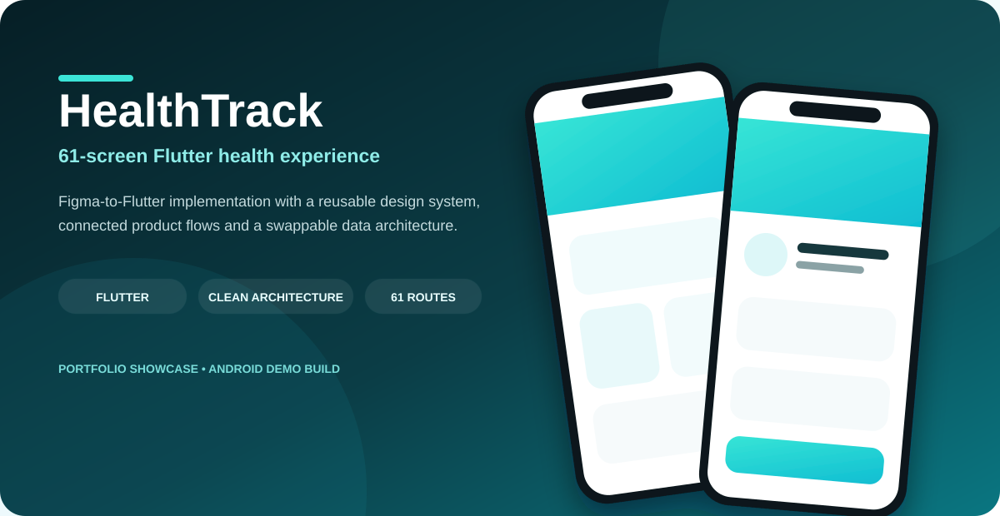
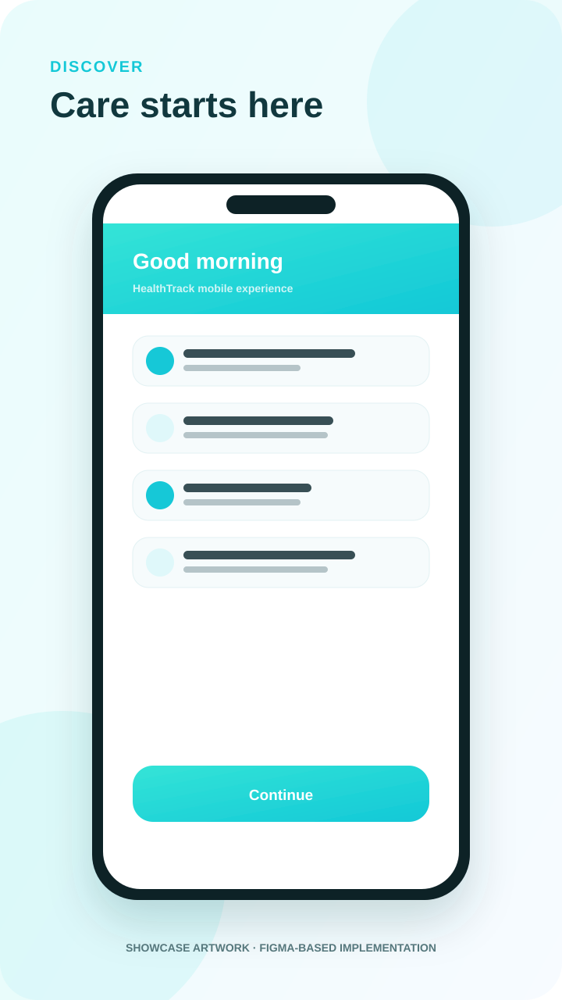
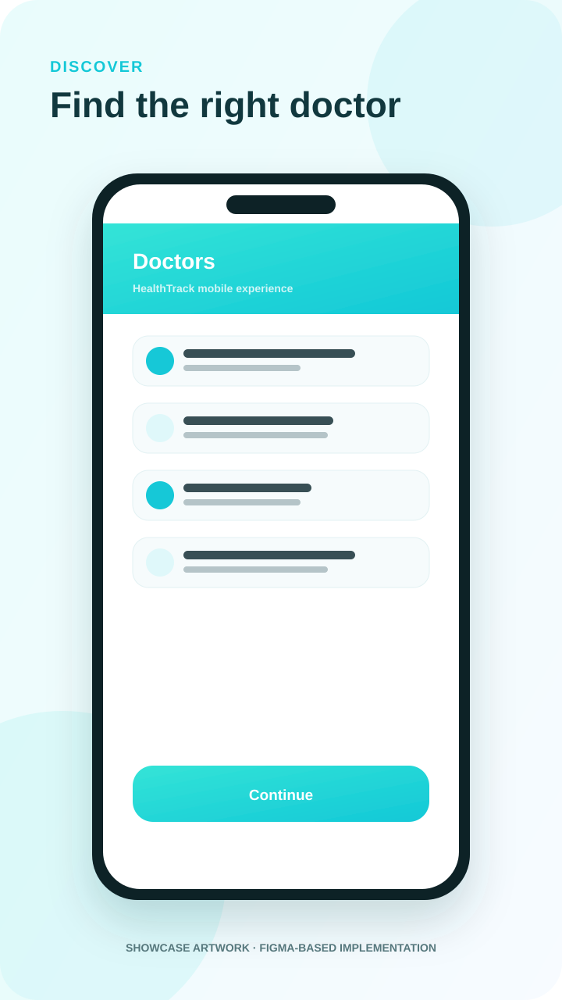
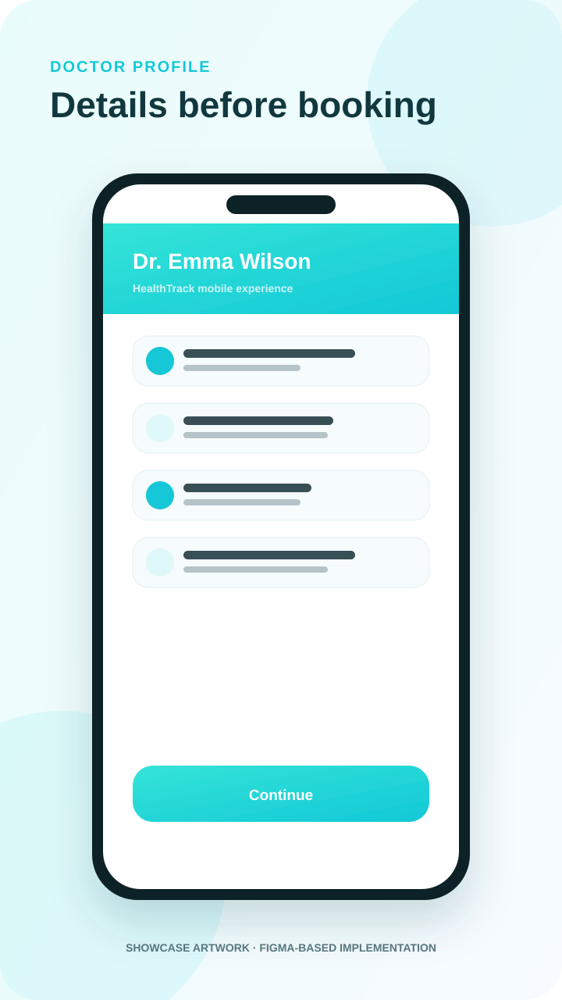
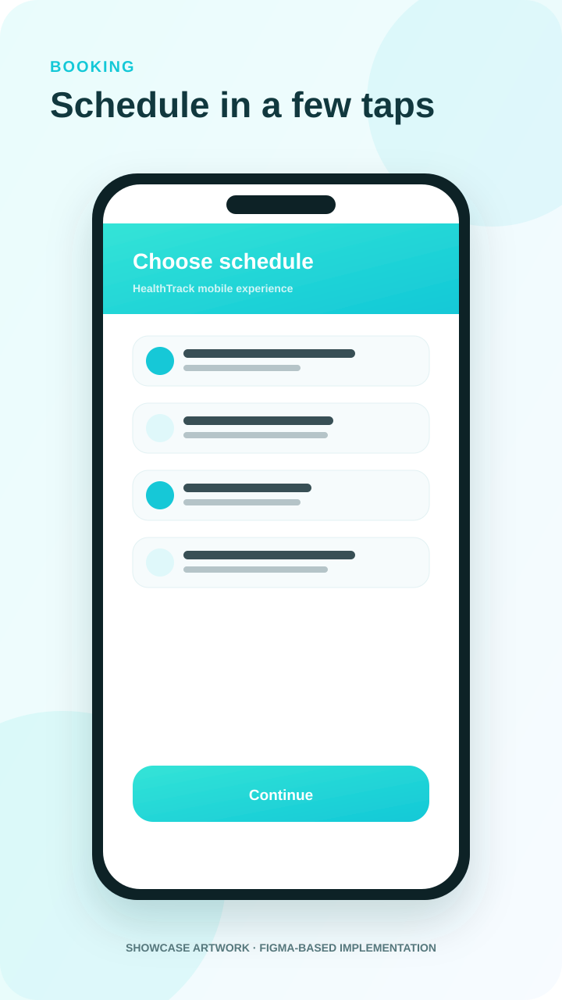
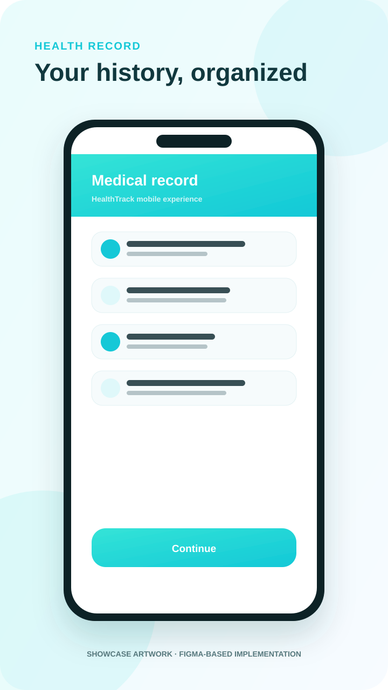

<div align="center">
  <a href="https://husseinabozina.github.io/medical_app/">
    
  </a>

  <h1>HealthTrack · Flutter Health Experience</h1>

  <p><strong>61-screen Figma-to-Flutter implementation with connected flows, reusable architecture, automated tests and an installable Android showcase build.</strong></p>

  <p>
    <a href="https://husseinabozina.github.io/medical_app/"><strong>Open live showcase</strong></a>
    ·
    <a href="https://github.com/Husseinabozina/medical_app/releases/download/showcase-latest/healthtrack-demo.apk"><strong>Download APK</strong></a>
    ·
    <a href="https://www.figma.com/design/jrf18b58l0rdFM4uTN5DEg/Medical-App-UI-Kit-Health-Mobile-App-Tracker-Appointment-Mobile-App--Community-?node-id=2279-1229&m=dev">Figma reference</a>
  </p>

  <p>
    
    
    
    
  </p>
</div>

---

## Overview

**HealthTrack** is a complete Flutter implementation of a Figma Community healthcare UI system. The project turns the source design into a connected app experience rather than a set of isolated screens.

The implementation covers doctor discovery, specialties, favorites, doctor profiles, booking, appointment states, messaging, pharmacy flows, medical records, profile/settings/help and payment UX.

My focus in this project is **Flutter engineering and product implementation**: translating the design system into reusable code, connecting the journeys, hardening navigation, shaping a replaceable data boundary and keeping the project testable.

> The Figma Community file is the visual reference. This repository contains the Flutter implementation and engineering work; it does not claim authorship of the original UI kit.

## Selected showcase artwork

The portfolio site uses lightweight SVG showcase artwork instead of multi-megabyte PNG captures, keeping GitHub Pages fast while preserving the visual character of the implemented flows.

<div align="center">
  <table>
    <tr>
      <td></td>
      <td></td>
      <td></td>
    </tr>
    <tr>
      <td></td>
      <td></td>
      <td></td>
    </tr>
  </table>
</div>

## Product coverage

- **61 / 61** top-level Figma frames represented as Flutter routes.
- All **8 specialty** doctor-list variants.
- Favorites, rating and female/male/service variants.
- Profile, settings, password, privacy, FAQ/contact and logout flows.
- Upcoming, completed, cancelled and cancellation appointment states.
- Pharmacy discovery, filters and details.
- Medical record, allergies, analysis/detail, vaccinations and history.
- Payment method, add-card, summary and success flows.
- Reliable back-navigation fallbacks across bottom-navigation and nested flows.

## Architecture

```text
Screen / Cubit
      ↓
HealthRepository
      ↓
HealthDataSource
      ↓
MockHealthDataSource     ← current showcase adapter
REST / Firebase adapter  ← replaceable future adapter
```

The downloadable showcase build uses a deterministic **local demo data source** with short simulated latency. It supports session mutations for:

- favorites;
- outgoing messages;
- appointment cancellation and re-booking;
- medical-record additions;
- saved payment cards;
- profile updates.

The domain/UI layers depend on repository contracts, so replacing the local adapter with a real API does not require rebuilding the screen layer.

## Engineering highlights

- reusable Figma-derived design tokens and components;
- pragmatic Clean Architecture without ceremonial layers;
- feature-focused screen organization;
- `go_router` route catalog with 61 unique routes;
- Cubit state for favorites and booking selections;
- deterministic back-navigation fallbacks;
- widget and data-layer regression tests;
- GitHub Actions running `flutter analyze` and `flutter test`;
- dedicated Android showcase release workflow.

## Android showcase build

The repository publishes an installable Android APK through GitHub Releases:

**[Download healthtrack-demo.apk](https://github.com/Husseinabozina/medical_app/releases/download/showcase-latest/healthtrack-demo.apk)**

The build demonstrates the implemented app journeys using the local demo data source. It does **not** represent a live healthcare provider, real medical records, real doctor availability or production payment processing.

## Run locally

If generated platform folders are not present yet:

```bash
flutter create . --platforms=android,ios,web,macos
flutter pub get
flutter analyze
flutter test
flutter run --dart-define=BACKEND_MODE=mock
```

VS Code / Cursor also includes a **HealthTrack — Mock** launch configuration.

## Design language

Core palette:

- Aqua `#33E4DB`
- Cyan `#00BBD3`
- Primary `#13CAD6`
- Soft blue `#E9F6FE`
- Pale lilac `#ECF1FF`
- Ink `#252525`

Motion stays deliberately calm: short route fades/slides, restrained selection feedback, splash/success motion and expandable content without aggressive bounce or visual noise.

<details>
<summary><strong>Full 61-screen Figma node → Flutter route catalog</strong></summary>

<br />

| # | Figma screen | Node | Flutter route |
|---|---|---|---|
| 01 | First Screen | `2279:1229` | `/` |
| 02 | Register | `2279:1230` | `/register` |
| 03 | Onboarding A | `2124:45` | `/onboarding/1` |
| 04 | Onboarding B | `2146:472` | `/onboarding/2` |
| 05 | Onboarding C | `2146:499` | `/onboarding/3` |
| 06 | Log In A | `2109:103` | `/login` |
| 07 | Log In B | `2109:140` | `/login/form` |
| 08 | Sign Up | `2109:169` | `/signup` |
| 09 | Set Password | `2109:216` | `/set-password` |
| 10 | Home | `2213:326` | `/home` |
| 11 | Specialties | `2068:756` | `/specialties` |
| 12 | Cardiology Doctors | `2237:1423` | `/specialties/cardiology` |
| 13 | Doctors | `2068:376` | `/doctors` |
| 14 | Doctor Info | `2112:1361` | `/doctor/:id` |
| 15 | Favorite Doctor | `2112:802` | `/favorites` |
| 16 | Profile | `2133:1964` | `/profile` |
| 17 | Settings | `2133:2024` | `/settings` |
| 18 | Notification | `2112:1667` | `/notifications` |
| 19 | Message | `2112:1720` | `/message` |
| 20 | Filter | `2079:520` | `/filter` |
| 21 | Doctor Profile | `2097:1242` | `/doctor/:id/profile` |
| 22 | Schedule | `2088:1073` | `/doctor/:id/schedule` |
| 23 | Appointment Upcoming | `2194:422` | `/appointments/upcoming` |
| 24 | Appointment Details | `2088:1187` | `/appointments/details` |
| 25 | Review | `2111:1410` | `/review` |
| 26 | Pharmacy | `2078:1049` | `/pharmacy` |
| 27 | Medical Record | `2076:911` | `/medical-record` |
| 28 | Payment Method | `2128:1556` | `/payment/method` |
| 29 | Payment Summary | `2128:1624` | `/payment/summary` |
| 30 | Payment Successfully | `2128:1676` | `/payment/success` |

| 31 | Dermatology Doctors | `2237:1809` | `/specialties/dermatology` |
| 32 | General Doctors | `2237:2227` | `/specialties/general` |
| 33 | Gynecology Doctors | `2237:2351` | `/specialties/gynecology` |
| 34 | Odontology Doctors | `2237:2592` | `/specialties/odontology` |
| 35 | Oncology Doctors | `2237:2715` | `/specialties/oncology` |
| 36 | Ophthalmology Doctors | `2243:1478` | `/specialties/ophthalmology` |
| 37 | Orthopedics Doctors | `2243:1596` | `/specialties/orthopedics` |
| 38 | Doctor Rating | `2112:1184` | `/favorites/rating` |
| 39 | Favorite Services | `2112:728` | `/favorites/services` |
| 40 | Favorite Female Doctors | `2112:912` | `/favorites/female` |
| 41 | Favorite Male Doctors | `2112:1045` | `/favorites/male` |
| 42 | Edit Profile | `2133:2100` | `/profile/edit` |
| 43 | Notification Setting | `2133:2058` | `/settings/notifications` |
| 44 | Password Manager | `2133:2138` | `/settings/password-manager` |
| 45 | Privacy Policy | `2133:2044` | `/settings/privacy` |
| 46 | Help Center FAQ | `2052:4238` | `/help/faq` |
| 47 | Help Center Contact Us | `2133:2220` | `/help/contact` |
| 48 | Logout | `2221:336` | `/logout` |
| 49 | Appointment Complete | `2194:608` | `/appointments/complete` |
| 50 | Appointment Cancelled | `2194:545` | `/appointments/cancelled` |
| 51 | Cancel Appointment | `2111:1373` | `/appointments/cancel` |
| 52 | Pharmacy Filter | `2078:1198` | `/pharmacy/filter` |
| 53 | Pharmacy Details | `2078:1239` | `/pharmacy/details` |
| 54 | Medical Record Add Record | `2097:1121` | `/medical-record/add` |
| 55 | Medical Record Menu | `2110:221` | `/medical-record/menu` |
| 56 | Allergies | `2213:552` | `/medical-record/allergies` |
| 57 | Analysis | `2107:156` | `/medical-record/analysis` |
| 58 | Analysis Details | `2107:508` | `/medical-record/analysis/detail` |
| 59 | Vaccinations | `2107:188` | `/medical-record/vaccinations` |
| 60 | Medical History | `2107:220` | `/medical-record/history` |
| 61 | Payment Method — Add Card | `2128:1588` | `/payment/add-card` |

All **61 top-level HealthTrack UI frames** from the Figma page are now represented in Flutter. Repeated doctor/specialty layouts share reusable widgets internally, while each source frame keeps its own route and portfolio state.

</details>

## Repository structure

```text
lib/
  app/
  core/
    app_environment.dart
    design_system.dart
    health_domain.dart
    health_state.dart
    navigation.dart
  data/
    backend_factory.dart
    health_repository_impl.dart
    mock/
  features/
    auth/
    home/
    account/
    appointments/
    services/
    payments/
    extended/
  router/
test/
docs/
  index.html
  styles.css
  script.js
  assets/
```

## Portfolio website

The responsive portfolio lives in `docs/` so GitHub Pages can be published from **main / docs**.

**Live URL:** https://husseinabozina.github.io/medical_app/

The site intentionally uses lightweight SVG showcase assets and lazy-loading to avoid the long image waits that can happen when a portfolio ships several full-resolution PNG screenshots.

---

<div align="center">
  <sub>HealthTrack · Flutter engineering showcase by Hussein Abozina</sub>
</div>
